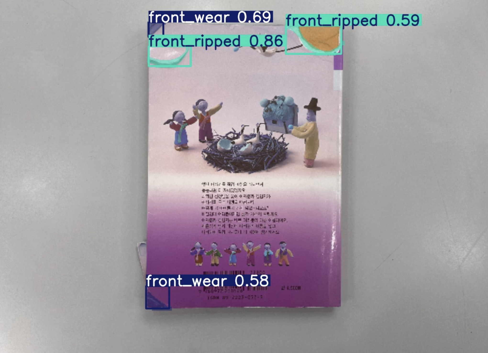

# Damage Detection on Books

This is a chatbot system for a second-hand bookstore, enabling the retrieval of book information and damage detection from user-submitted photos for reselling.
<p align="center">
    
</p>

## Running Tests

To run tests, run the following command

See `.env` and add API to get started.

```bash
  streamlit run Homepage.py
```

You will find entire demo about this project.

If you want to run test, click  `demo` on the left sidebar.
